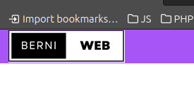
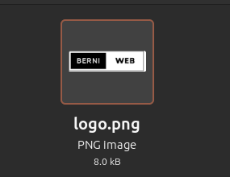
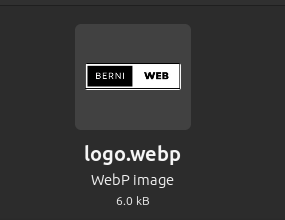
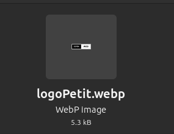
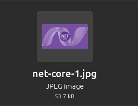
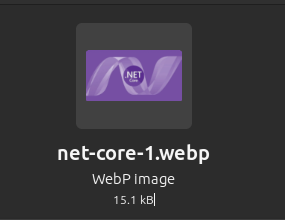
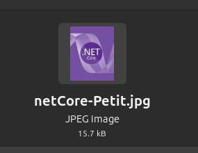

## Documentació (Extensio del projecte 1)

### 1. Header i Footer
- Els canvis en el header, han set rempleçar el nom que anterior posava "Cursos Tecnologics" per el logo de la empresa.

- S'ha creat un footer amb el link de les altres pàgines.

### 2&3. Imatges i Responsivitat
Imatges Modificades/Afegides:
- **logo.webp**: Logo afegit en tots els headers de les pàgines. S'ha posat com a .webp perquè és un format més lleuger que el .png. Amb això hem pasat de 8.0 kB a 6.0 kB.

- **logoPetit.webp**: Imatge afegida a la pàgina de about, aqui s'ha afegit una imatge mes petit en format .webp del logo ja que hem decidit afegir en aquesta pàgina i quan es fa mes petita la resolucio de la pantalla sigui més petita, però era per resolucions molt petites!

- **net-core.webp**: Imatge modificada pasada de .jpg a .webp perquè és un format més lleuger. Amb això hem passat de 53.7 kB kB a 15.1 kB.

- **net-core-Petit.webp**: Imatge creada en format .webp per quan la resolucio de pantalla sigui molt petita, així no es veu la imatge molt gran. També s'han retallat les vores de l'imatge ja que no eren rellevants

### 4. Animacions
- S'ha creat una animació molt basica en el botó del index.html:

Aquesta fletxa es va difuminant i apareixent.

## Decisions preses

He decidit passar a utilitzar webp en totes les imatges ja que era el format que més adient que he trobat per la seva bona relacio qualitat - pes.
També he retellat una imatge ja que el mé important era en el centre de l'imatge i al fer la pantalla més petita ocupava massa espai per un tros que no era rellevant.

També he baixat la qualitat fins al 70% en la foto del curs especific, i en el 58% en el logo posat al about i al header

Amb tot aixo, s'ha intentat buscar la millor relació qualitat - pes per aconseguir una pagina web més lleugera i que carregui més rapid sense perdre qualitat en les imatges.